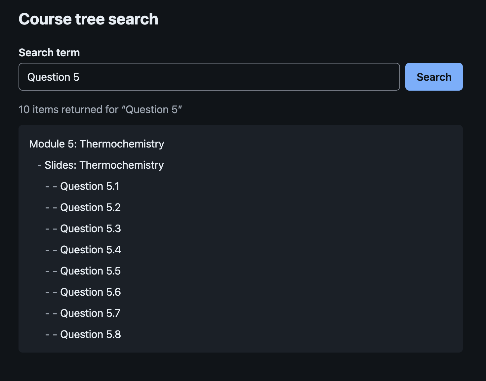

# Course tree search

A student types a term, the app sends it to the course tree search service and
shows what comes back as an outline, each child under its parent with one
hyphen per level of depth. The service is the sandbox at
`https://coursetreesearch-service-sandbox.dev.tophat.com`, reached through a
local `/api` proxy.



## Run it

`.nvmrc` pins Node 22. `engines` in `package.json` accepts
`^20.19.0 || ^22.13.0 || >=24.0.0`, the range jsdom and Vite support, and
the suite was run on Node 22 and 26. There are no runtime dependencies beyond
React and ReactDOM.

```sh
nvm use          # reads .nvmrc
npm install
npm run dev      # http://localhost:5173/, with /api forwarded to the sandbox
npm test         # vitest run, once, no watch
npm run lint     # eslint .
npm run build    # typecheck, then vite build into dist/
npm run preview  # serves dist/ at http://localhost:4173/ with the same /api forwarding
```

`npm run typecheck`, `npm run format` and `npm run format:check` also exist.

Terms to try, with what the sandbox returned on 30 September 2026:

- `a`: 350 items, most of the course.
- `e`: 369 items.
- `Module`: 344 items, every module with its sections and questions.
- `error`: the service answers HTTP 400, and the app says the term was
  rejected and offers no retry.
- `Lab`, the term in the brief's example: an empty array today, so the app
  says no items were returned.

The sandbox also answers 503 or 504 now and then, and holds some responses for
a few seconds. The app shows those as a service problem with a Try again
button, and pressing it resends the same term.

## Sandbox behaviour

Observed on 29th September 2026 against
`https://coursetreesearch-service-sandbox.dev.tophat.com`.

- The path given in the brief, `/treesearch/?query=`, returns 404 with a JSON body,
  with and without the trailing slash. The service root, `/?query=`, returns results.
  The client targets the root; `buildSearchUrl` is the one place to change if the
  path is restored.
- A successful response is a bare JSON array of `{ "id": integer, "name": string,
"parent_id": integer }`, for example `{"id":88,"name":"Question 5.1","parent_id":87}`.
  No wrapper object and no other fields were seen.
- `error` returns HTTP 400 with `{"detail":"Query invalid"}`. The app shows it as a
  rejected term.
- `Lab`, the term used in the brief's example, currently returns an empty array.
  Single letters return most of the course: `a` 350 items, `e` 369, `i` 363; `Module`
  344; `Question` 278; about 24 KB each.
- Across those queries no response contained duplicate ids, missing parents or
  cycles, and every item's ancestors were included. Nineteen names carry trailing
  whitespace and are shown as sent.
- Ids follow the course's authored order (Question 5.1 to 5.8 are ids 88 to 95) while
  the order of items in a response does not, so siblings are sorted by id.
- Responses vary between runs. `o` returned a non-array JSON body once and a normal
  array minutes later; `Chemistry`, `Experiment` and `Colloidal` returned 504 with an
  HTML body on the 28th. An `access-control-allow-origin: *` header was present for a
  localhost origin on the 28th and absent on the 30th, so nothing depends on it.

To reproduce:

```sh
B='https://coursetreesearch-service-sandbox.dev.tophat.com'
curl -s -o /dev/null -w '%{http_code}\n' "$B/treesearch/?query=a"      # 404
curl -s "$B/?query=a" | head -c 200; echo                              # bare array
curl -s "$B/?query=Lab"; echo                                          # []
curl -s -w '\n%{http_code}\n' "$B/?query=error"                        # {"detail":"Query invalid"} 400
curl -s -D - -o /dev/null -H 'Origin: http://localhost:5173' "$B/?query=a" | grep -i access-control || echo 'no CORS header'
```

## Architecture

```
src/
  main.tsx                  mounts App inside StrictMode and loads styles.css
  App.tsx                   builds the HTTP client once and renders the page around CourseSearch
  App.test.tsx              journeys through the whole page
  styles.css                colour tokens, dark mode, focus rings, the outline's indent and pre-wrap rows
  vite-env.d.ts             types VITE_API_BASE_URL on import.meta.env
  test/setup.ts             jest-dom matchers, cleanup after each test, and fetch stubbed to throw
  test/setup.test.ts        checks that the setup file did both
  course-search/
    types.ts                CourseItem, TreeNode, DataIssue, SearchErrorCode
    client.ts               SearchClient, TreeSearchError, resolveBaseUrl, buildSearchUrl, parseResponse, createHttpSearchClient
    tree.ts                 buildTree, prefixFor, formatOutline, descendantCount
    useCourseSearch.ts      the reducer, the request contract and the hook
    CourseSearch.tsx        the form; composes SearchResults
    SearchResults.tsx       status line, alert, retained tree; exports messages and recoveryFor
    TreeOutline.tsx         nested lists, one row per node
    *.test.ts, *.test.tsx   tests beside the file they cover
```

Five responsibilities: `client.ts` is transport, `tree.ts` is hierarchy,
`useCourseSearch.ts` is lifecycle, `TreeOutline.tsx` is rendering, and
`CourseSearch.tsx` with `SearchResults.tsx` is composition.

Runtime imports point one way. Components import the hook and `tree.ts`; the
hook imports `client.ts` and `tree.ts`; `client.ts` and `tree.ts` import only
`types.ts`. `App.tsx` imports `course-search` and nothing imports `App.tsx`.
Type-only imports are fine anywhere.

A second feature that reads the tree, such as copying the outline, is a
component beside `TreeOutline.tsx` that takes the roots and calls
`formatOutline`; the hook and the client do not change. A feature that needs
new data from the service, such as a matched flag, starts in `types.ts` and
`parseResponse`, continues in `buildTree` if the tree has to carry it, and
reaches the components last.

## State and the request contract

The hook keeps this state in a reducer:

```ts
type Status =
  | { kind: 'idle' }
  | { kind: 'loading'; query: string; requestId: number }
  | { kind: 'ready'; query: string; requestId: number }
  | { kind: 'error'; query: string; requestId: number; code: SearchErrorCode };

interface State {
  status: Status;
  lastResult: { query: string; roots: TreeNode[] } | null;
}

type SearchErrorCode =
  | 'invalid-query'
  | 'service'
  | 'network'
  | 'timeout'
  | 'invalid-response'
  | 'unusable-data'
  | 'unknown';
```

`lastResult` sits outside `status` because it outlives any one status. The
last tree stays on screen while the next search loads and when that search
fails, so it belongs to neither the `loading` nor the `error` variant. Each
status variant describes only the current request, and the view reads both
fields: the status decides the line above the tree and whether there is an
alert, and `lastResult` decides whether a tree is shown at all.

Requests are tracked outside React state, in a ref holding the active request
`{ requestId, query, controller }` or null, beside an id counter and a
disposed flag owned by a mount effect. The hook's header comment carries these
rules:

1. `search(q)`: if a request is active and `active.query === q`, do nothing.
2. Otherwise, if disposed, do nothing. Else abort `active.controller`,
   allocate an id, set active, dispatch `started`, and call
   `client.search(q, controller.signal)`.
3. A request clears active only if `active.requestId` is its own id.
4. On settle, dispatch only if `active.requestId` is its own id and disposed is
   false. Otherwise nothing.
5. Effect setup sets disposed false; cleanup sets it true, takes and nulls
   active, then aborts what it took. This survives StrictMode's setup, cleanup,
   setup in development.
6. After cleanup, a late settlement dispatches nothing.
7. `retry()` reads the query from status and calls `search`.
8. An `aborted` rejection is ignored only when this hook's own controller
   signal is aborted. Any other aborted rejection settles as `unknown` and
   releases active.

On success the items go through `buildTree`. Any issue dispatches `failed`
with `unusable-data`; otherwise `succeeded` carries the roots. The reducer
checks `requestId` again and returns the identical state object for a stale
action, so the ref is the first guard and the reducer the second.

## What a result means

The service chooses the items and the app does not know why. The brief's own
example returns items that do not contain the term, so the summary says
"N items returned for “term”", counting every node in the tree, and never
"match". Nothing is highlighted for the same reason.

The last tree with at least one root stays visible through loading, dimmed
and marked `aria-busy`, and under the alert after a failure. When its query is
not the current one, a line above it says "Showing previous results for
“term”". An empty result is not retained: a failure after an empty result
shows only the alert. Names are shown as sent, trailing spaces included, and
a selected row copies as the brief's line for it, prefix and name together.

Failures are shown by what the student can do next. Status codes and issue
details stay inside the error; the view reads only the code.

```
condition                        code              what the student sees
HTTP 400                         invalid-query     rejected term, no button
term cannot be URL-encoded       invalid-query     rejected term, no button
other non-2xx                    service           Try again
fetch rejected by the timer      timeout           Try again
fetch rejected otherwise         network           Try again
bad body or shape                invalid-response  Try again
buildTree issues                 unusable-data     Try again
anything else                    unknown           Try again
```

Non-2xx is decided before any body is read. A term that cannot be URL-encoded
is rejected before any request; an already-aborted signal still wins. The
timeout is ten seconds.

## Hierarchy policy

`buildTree` turns the flat list into `{ roots, issues }`:

```
input                                  placement
parent_id 0                            top level
parent not in the list                 top level, children under it
identical duplicate rows               collapsed
same id, different name or parent      duplicate-id issue
cycle or self-parent, and beneath      cycle issue, affectedIds sorted
```

It never throws, never repairs and never mutates its input, and it walks with
an explicit stack rather than recursion, so a chain thousands deep builds.
When there are issues the roots are still returned, built from the first
occurrence of each id, but the hook treats any issue as unusable data and does
not show them.

The roots and every sibling list are sorted by ascending id. The evidence is
in the brief and in the sandbox: the brief's example places Surface Chemistry
(id 3) before Lab 1 Summary (id 4) and Starch (id 2) before Gum (id 7), which
is id order, and in the sandbox Question 5.1 to 5.8 are ids 88 to 95 while
the order they arrive in is not. That ids reflect authored order is an
assumption supported by the sampled responses (Question 5.1 to 5.8 are ids
88 to 95), not a documented API guarantee.

## Decisions and assumptions

- The brief's `/treesearch/` path returned 404 on 28 to 30 September 2026; the service root returns results, so the client targets the root. `buildSearchUrl` is the one place to change if the path is restored.
- The parser is strict to the observed shape: a bare array of integer `id`, string `name`, integer `parent_id`. One malformed item fails the response, because a partial tree is silently wrong. Names are shown as sent, trailing spaces included.
- Siblings are sorted by ascending id. The brief's example is consistent with it, and sandbox ids follow authored order (Question 5.1 through 5.8 are ids 88 through 95) while response order does not.
- The validated tree is the result. The outline renders it as nested lists with a hyphen prefix per depth; the same walk produces the brief's text format for tests. There is no separate flat representation.
- An item whose parent is not in the result set renders at the top level with its children. In the sandbox every response included ancestors, so this is defensive.
- Corrupt structure (a conflicting duplicate id or a parent cycle) is reported as unusable data and not rendered; the previous result stays on screen. Identical duplicates collapse. Render-with-a-notice was the alternative. Never observed in the sandbox.
- The summary says "N items returned" and never "match", because the brief's example returns items that don't contain the term. No highlighting for the same reason; a `matched` flag from the service is the first thing to add.
- Errors are presented by what the student can do: a rejected term (HTTP 400, the service's invalid-query response) asks for a different term with no retry; service, network, timeout and malformed responses offer Try again; unusable data says so and offers Try again. Status codes stay internal.
- The last good result stays visible through loading (dimmed, `aria-busy`) and errors, labelled with its query when that differs from the current one. An empty result is not retained.
- Duplicate and stale requests are decided by a synchronous active-request ref; the reducer's `requestId` check is a second, pure guard. An aborted rejection is ignored only when this hook aborted it, so a misbehaving client cannot leave the UI stuck. The `disposed` flag is reset in effect setup, so StrictMode's double effect cycle does not disable the hook.
- Ten-second timeout. Terms trimmed. Blank cannot submit. Submitting while loading is allowed. No autofocus.
- Nothing is instrumented. What I would measure for this feature: searches per session, share returning zero items, share failing by recovery type, and time to first result; each of those changes a decision (query guidance, service health, timeout). A telemetry abstraction without a sink is not evidence of that judgment, so it isn't here.
- No data-fetching library (one endpoint, no cache or invalidation), no contexts (the client is a prop), no router, no CSS framework, no external fonts, no backend. Dev and preview proxy `/api`; production resolves the base URL from the environment, then a compiled default.
- The parser type-checks the fields the app depends on and ignores unknown fields, so it survives additive API changes without a release.
- A term that cannot be URL-encoded (a lone surrogate) is treated as a rejected term before any request is sent.
- Try again moves focus to the search field, because the button unmounts with the alert and both of the student's next actions, waiting or changing the term, start there.

## Accessibility

The search field has a visible label and `type="search"`, inside a form with
`role="search"`. Nothing takes focus on load. The results live in a section
labelled "Search results".

The outline is nested `<ul>` elements with `list-style: none`, so a screen
reader hears the depth from the nesting; the hyphen prefix is `aria-hidden`
because it repeats that depth visually. Each list carries an explicit
`role="list"` because Safari removes list semantics from lists styled without
markers. The summary, the searching line and
the no-results line share one `role="status"` element that is always
mounted, so it exists before its text changes. The alert is mounted only while
a search has failed. The retained tree carries `aria-busy` while the next
search loads and is dimmed to match; the dimming transition is removed under
`prefers-reduced-motion`. Try again moves focus to the search field, because
the button unmounts with the alert. Focus rings use `:focus-visible`, and
colours come from tokens with a `prefers-color-scheme: dark` set.

## Testing

`src/test/setup.ts` runs before every test file. It registers the jest-dom
matchers, cleans up Testing Library renders after each test and replaces the
global `fetch` with a function that throws, so a test that reaches for the
network fails at once; every test injects a fetch or a fake client instead.
`setup.test.ts` checks both halves of that.

`tree.test.ts` walks the brief's example into its seven lines, checks the
node shape, puts shuffled sandbox questions back in order and covers the
hierarchy policy row by row: children arriving before parents, sorting of
roots and siblings by numeric id, a parent missing from the list, an item with
id 0 beside `parent_id` 0, identical duplicates collapsing, conflicting
duplicates with a different name or parent, several conflicts reported once
each in order, a two-node cycle with a child beneath it, a self-parent, two
separate cycles in one issue, a conflict and a cycle from the same list, a
chain five thousand deep, and a frozen input left unchanged. `prefixFor` and
`descendantCount` have their own small groups.

`client.test.ts` covers `resolveBaseUrl` (the override, a blank override, the
dev and production defaults), `buildSearchUrl` (the root path, a base ending
in a slash, characters that need encoding, a lone surrogate), `parseResponse`
(the sandbox's bare array, trailing whitespace and id 0, unknown fields
ignored, the index of the first bad item) and `createHttpSearchClient`: a 200,
an empty array, each non-2xx status with the body left unread, a `TypeError`
from fetch, a fetch that throws instead of rejecting, a 200 carrying HTML, an
empty body, truncated JSON, an object or a wrongly shaped item, a term that
cannot be encoded, aborts before the request, during the response and during
the body read, a timeout while waiting for the response and during the body
read, the ten-second default, a caller abort landing after the time ran out,
and cleanup of the timer and the abort listener after every outcome.

`useCourseSearch.test.ts` renders the hook against a fake client whose
promises settle by hand. It checks loading to ready, the 400 code, one call
for two identical searches in one tick, a second call once the first has
settled, abort of a superseded search and the fate of its late result, a
request that settles after unmount, a search made after unmount, StrictMode,
an aborted rejection the hook did not cause, unusable data from a cyclic
response, and retry. A table of stale actions checks that the reducer returns
the identical object for each. The foreign-abort case checks rule 8: a
client that rejects as aborted on its own settles as unknown and releases the
request, so the next search goes through.

`TreeOutline.test.tsx` checks that a child list is nested inside its parent's
list item and that each row's text is the line `formatOutline` produces for
it. `SearchResults.test.tsx` checks the attribution line over a retained tree
while another query loads or has failed, its absence when the tree belongs to
the current query, Try again for a service error, no Try again for an invalid
query, and only the alert when the previous result was empty.
`CourseSearch.test.tsx` checks that a blank or whitespace term cannot submit,
that Enter submits the trimmed term, and that Try again moves focus to the
field.

`App.test.tsx` runs journeys through the whole page. With a fake client: the
Lab tree with its attribution when Exam fails with a 500 and Try again
refetching Exam, the rejected copy for a 400, a second search beating a slow
first one and the late first result leaving it alone, and the no-results line
for an empty list. One journey runs the real `createHttpSearchClient` with an
injected fetch that answers a 504 HTML page and then the brief's fixture, and
ends on the brief's seven lines and the summary.

## Verified

Browser checks in Chrome on macOS, Node 22 and 26, 30 September 2026.

- `a`: 350 items returned, sections and questions in id order (Module 1 before 5 before 18; Question 5.1 to 5.8), count equal to the rows on screen.
- `error`: "The search service rejected this term. Try a different one", no Try again button; the `a` tree stayed visible underneath with "Showing previous results for “a”".
- `Chemistry`, which returned 504 on 28 September: 78 items today, so the failure path was exercised offline instead (below).
- `e` followed immediately by `a`: the outline ended on `a`; the late `e` response did not replace it.
- Offline: "Could not reach the search service. Check your connection and try again." with Try again, previous tree retained; back online, Try again recovered.
- Keyboard only: Tab reaches the search field and, after a failure, the Try again button; Enter on Try again returned focus to the search field.
- `Lab 1` and `Gibbs & energy`: requests sent as `?query=Lab%201` and `?query=Gibbs%20%26%20energy`.
- `npm run build && npm run preview`: 350 items for `a` through the preview proxy.
- Clean archive: unpacked into an empty directory; npm ci, lint, typecheck, test, build and preview ran as under Run it, and a search returned results.

## Deployment

`resolveBaseUrl` picks the base URL at build time. `VITE_API_BASE_URL` wins
when it is set and not blank; otherwise the dev server uses `/api`; otherwise
a build uses the compiled default, which is also `/api`. Vite inlines
`import.meta.env` into the bundle, so a change to the environment needs a
rebuild, not a restart.

`/api` is a path on the app's own origin, so whatever serves `dist/` has to
forward it to the service with the prefix removed. `npm run preview` does
this. On a static host the forwarding rule has to be added, for example in
nginx:

```nginx
location /api/ {
  proxy_pass https://coursetreesearch-service-sandbox.dev.tophat.com/;
  proxy_set_header Host coursetreesearch-service-sandbox.dev.tophat.com;
  proxy_ssl_server_name on;
}
```

An SPA fallback is not a forwarding rule. A host that answers every unknown
path with `index.html` would answer `/api/?query=a` with the page itself and
a 200, which the parser rejects as an invalid response.

To call a service directly instead, build with `VITE_API_BASE_URL` set to its
absolute URL; that origin then has to send CORS headers, and the sandbox's
header has been present on some days and absent on others.

Local execution through `npm run dev` and `npm run preview` is the tested
path. No hosted deployment has been exercised.

## Next

- A `matched` flag from the service. Once the service says which items
  matched the term, the summary can count matches and the outline can mark
  them; both are held back today because the app cannot tell.
- Copy outline. A button beside the tree that puts `formatOutline(roots)` on
  the clipboard, the same text the tests compare against.
- Collapsible sections. Each node with children becomes a disclosure, with
  `descendantCount` giving the number hidden behind a closed one.
- URL state. The term in `?q=` so a search can be linked and reloaded, with
  the request contract unchanged.
- i18n. The copy is already in one object, `messages`; the strings would move
  to a locale file and the summary's plural into a plural rule.
- A contract test in CI. A scheduled run against the sandbox that checks the
  root path, the response shape and the 400 for `error`, so a change to the
  service is noticed before a student sees it.

## Process

I used Claude for planning, review and implementation, and made the
decisions. Three of them were made in planning: the summary counts items
returned rather than matches, because the service returns context items; a
failed search keeps the previous result on screen; and the structure had to
leave room for a second feature. I designed around a written request
contract and a result that survives loading and errors, and checked each
part of it against the others. Looking at real data changed two decisions.
Sibling order looked arbitrary, and ids turned out to follow the course's
authored order, so siblings sort by id. A scan of the broad queries showed
the corrupt cases the policy handles were not observed in the sampled
responses, so the policy is documented as defensive. The design is one canonical tree, seven files, no telemetry and
no contexts, on the standard that another engineer should understand the
whole feature in one reading and I should be able to say why each piece
exists.

The brief's endpoint returns 404 and the service root works, which opens the
Sandbox behaviour section. The lifecycle contract test covers a foreign
abort: a client that rejects as aborted on its own settles as unknown rather
than leaving the hook in loading. I ran every browser check myself, verified
the zip from a clean extraction, and wrote the Decisions, Verified and this
section.

Time spent: 3-4 hours
